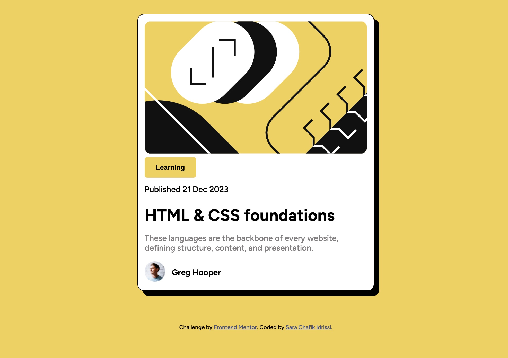

# Frontend Mentor - Blog preview card solution

This is a solution to the [Blog preview card challenge on Frontend Mentor](https://www.frontendmentor.io/challenges/blog-preview-card-ckPaj01IcS). Frontend Mentor challenges help you improve your coding skills by building realistic projects. 

## Table of contents

- [Overview](#overview)
  - [The challenge](#the-challenge)
  - [Screenshot](#screenshot)
  - [Links](#links)
- [My process](#my-process)
  - [Built with](#built-with)
  - [What I learned](#what-i-learned)
  - [Continued development](#continued-development)
  - [Useful resources](#useful-resources)
- [Author](#author)

**Note: Delete this note and update the table of contents based on what sections you keep.**

## Overview

### The challenge

Users should be able to:

- See hover and focus states for all interactive elements on the page

### Screenshot



### Links

- Solution URL: [Add solution URL here](https://github.com/sarachafikidrissi/Blog-preview-card)
- Live Site URL: [Add live site URL here](https://sarachafikidrissi.github.io/Blog-preview-card/)

## My process

### Built with

- Semantic HTML5 markup
- CSS custom properties
- Flexbox

### What I learned

I have learnt how to use CSS Flexbox , and also how to apply media queries to add some responsiveness on the page.
To see how you can add code snippets, see below:

```html
<h1>Some HTML code I'm proud of</h1>
```
```css
@media screen and (max-width: 760px) {

    .container {
        width: 45%;
        padding: 0.8rem;
    }
    h1 {
        font-size: 1.5rem;
    }
}
```


### Continued development

I would like to continue learning about Responsivness more so i can apply it on next projects

### Useful resources

- [CSS Box Shadow](https://www.w3schools.com/cssref/css3_pr_box-shadow.php) - This helped me fstyling the box shadow. I really liked this pattern and will use it going forward.
- [Button](https://www.w3schools.com/tags/tag_button.asp#gsc.tab=0) - HTML Button Tag and Style .

## Author

- Frontend Mentor - [@sarachafikidrissi](https://www.frontendmentor.io/profile/sarachafikidrissi)
- Twitter - [@SaraChafikIdri1](https://twitter.com/SaraChafikIdri1)

